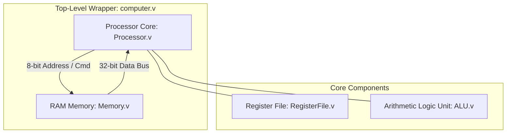
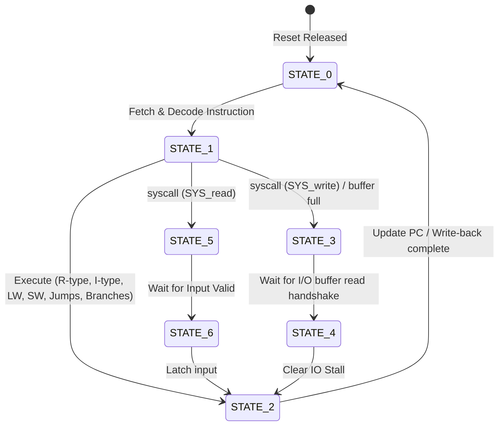

# 32-Bit FSM-Based Multi-Cycle MIPS Processor

This repository contains the design of a custom **32-Bit Multi-Cycle MIPS Processor** implemented in Verilog HDL. The architecture moves away from traditional pipelined design to implement a streamlined **3-Cycle Finite State Machine (FSM)** datapath, simplifying hazard resolution and optimizing control logic. 

Developed as part of the **CS220 (Computer Organization and Architecture)** course project at **IIT Kanpur** under the guidance of **Prof. Mainak Chaudhuri**.

---

## 📐 SoC Block Architecture



---

## 📁 Repository Structure

```text
.
├── defs.vh          # Global opcodes, function codes, and system call definitions
├── RegisterFile.v   # 32x32-bit register file (reads asynchronously, writes on negedge)
├── Memory.v         # 256-word byte-addressable RAM with sub-word write command support
├── ALU.v            # Combinational Arithmetic Logic Unit and Branch Calculator
├── Processor.v      # CPU core implementing the 3-state control FSM and big-endian loads/stores
├── computer.v       # Top-level system wrapper connecting CPU and Memory
└── README.md        # Project documentation
```

### Module Breakdown

| Module | Filename | Description |
| :--- | :--- | :--- |
| **SoC Wrapper** | [`computer.v`](file:///c:/Users/rajor/OneDrive/Documents/CS220-Project_32MIPS/computer.v) | Orchestrates clock cycles (`total_cycles`, `proc_cycles`), reset/initialization, and connects CPU and memory buses. |
| **CPU Core** | [`Processor.v`](file:///c:/Users/rajor/OneDrive/Documents/CS220-Project_32MIPS/Processor.v) | Houses the 3-state FSM, performs partial-word layout formatting, and handles system-call stalls. |
| **Execution Engine** | [`ALU.v`](file:///c:/Users/rajor/OneDrive/Documents/CS220-Project_32MIPS/ALU.v) | A pure combinational block executing mathematical operations, logical shifts, and branch/jump targets. |
| **Registers** | [`RegisterFile.v`](file:///c:/Users/rajor/OneDrive/Documents/CS220-Project_32MIPS/RegisterFile.v) | 32 registers of 32-bit widths. Implements asynchronous reads, synchronous writes on the negative edge, and a hardwired register `$0`. |
| **System Memory** | [`Memory.v`](file:///c:/Users/rajor/OneDrive/Documents/CS220-Project_32MIPS/Memory.v) | 1 KB RAM organized as 256 words of 32 bits. Supports byte/half-word write commands. |
| **Constants Header** | [`defs.vh`](file:///c:/Users/rajor/OneDrive/Documents/CS220-Project_32MIPS/defs.vh) | Global macros mapping instruction fields, function codes, and hardware I/O syscall numbers. |

---

## ⚡ Finite State Machine & Execution Flow

The processor operates on a 3-cycle execution cycle using a hardware FSM:



1. **State 0 (Fetch & Decode):** Retrieves the 32-bit instruction from memory and asynchronously fetches source registers from the register file.
2. **State 1 (Execute):** Configures ALU operands. Arithmetic/logic, memory address offset computations, or branch condition evaluations happen in this cycle. Stalls are initiated for I/O syscalls.
3. **State 2 (Write-Back / Commit):** Latch ALU or memory read results back to the destination register. Updates PC with either sequence (`PC + 1`) or jump/branch targets.

---

## 📑 MIPS Instruction Format & Opcodes

Each instruction is encoded as a 32-bit word, parsed dynamically by the processor:

| Format | Bit Field Configuration | Operations Covered |
| :--- | :--- | :--- |
| **R-Type** | `opcode[31:26]` \| `rs[25:21]` \| `rt[20:16]` \| `rd[15:11]` \| `shamt[10:6]` \| `funct[5:0]` | `add`, `sub`, `and`, `or`, `xor`, `nor`, `sll`, `srl`, `sra`, `sllv`, `srlv`, `srav`, `slt`, `sltu`, `jr`, `jalr`, `syscall` |
| **I-Type** | `opcode[31:26]` \| `rs[25:21]` \| `rt[20:16]` \| `immediate[15:0]` | `addi`, `andi`, `ori`, `xori`, `slti`, `sltiu`, `lui`, `lw`, `sw`, `lb`, `sb`, `lh`, `sh`, `lbu`, `lhu`, `beq`, `bne`, `bltz`, `bgez`, `blez`, `bgtz` |
| **J-Type** | `opcode[31:26]` \| `jump_target[25:0]` | `j`, `jal` |

---

## 📦 Big-Endian Sub-Word Memory Access

The system supports byte and half-word memory accesses natively, implementing Big-Endian offset alignment:

*   **Loads (`lb`, `lbu`, `lh`, `lhu`):** The data word is loaded, and the byte/half-word is shifted to the lowest significant bits. Unsigned loads apply zero-extension, and signed loads apply sign-extension before committing to the register file.
*   **Stores (`sb`, `sh`):** A custom write sequence fetches the target word from RAM, masks out the relevant byte/half-word slice, merges the new sub-word value from register `rt`, and commits the combined word to memory.

---

## 🚀 Verification & Simulation

To compile and simulate the complete MIPS processor SoC:

1. **Compile with Icarus Verilog:**
   ```bash
   iverilog -o mips_sim computer.v
   ```
2. **Run simulation using VVP:**
   ```bash
   vvp mips_sim
   ```
