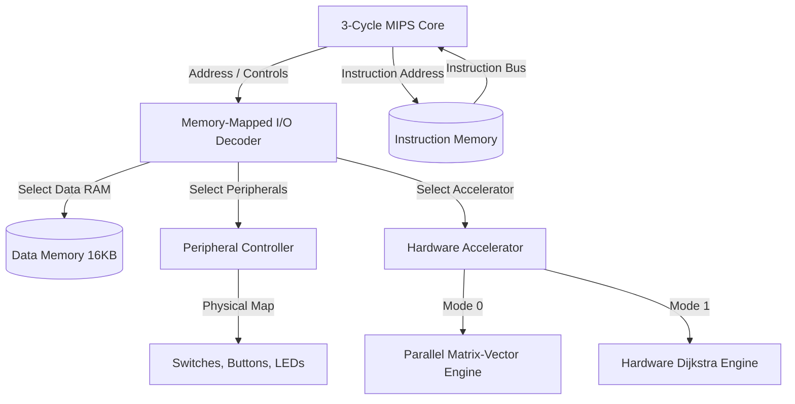
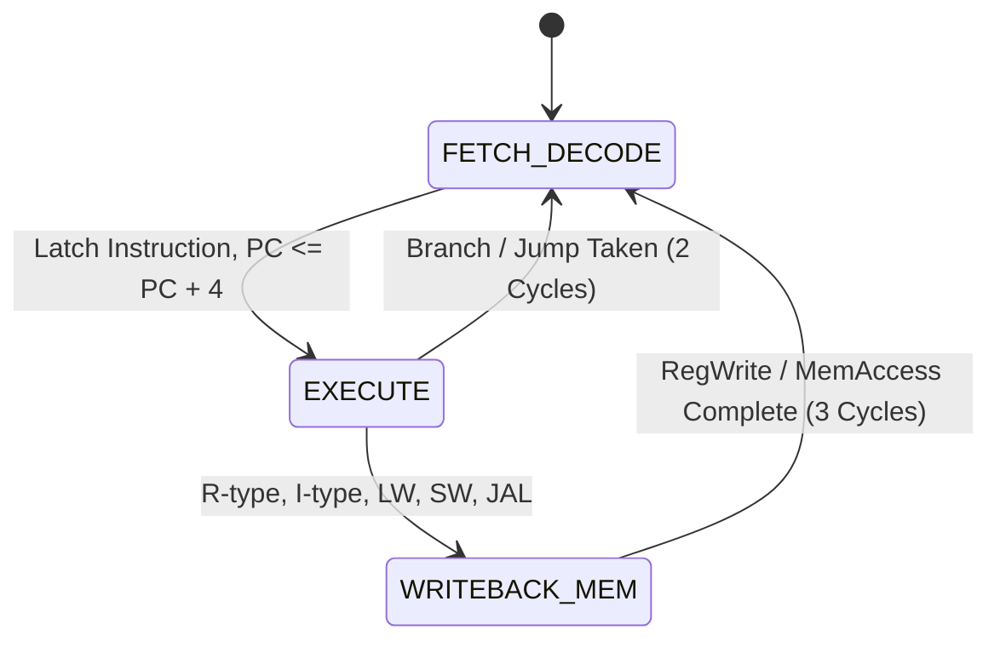

# 32-Bit Multi-Cycle MIPS Processor & FPGA Hardware Accelerator

[](#)
[](#)
[](#)
[](#)

This repository contains the complete implementation of a **3-Cycle 32-Bit Multi-Cycle MIPS Processor** and a **Custom FPGA Hardware Accelerator**, designed and verified for the **AMD/Xilinx PYNQ-Z2 FPGA board**. This project was developed as a course project for **CS220: Introduction to Computer Organization** under **Prof. Mainak Chaudhuri** at the **Indian Institute of Technology, Kanpur (IITK)**.

---

## 🚀 Key Features

*   **3-Cycle Multi-Cycle Processor:** A customized, synthesizable multi-cycle MIPS processor that executes instructions in exactly 2 or 3 cycles (optimizing R-type, logical, memory ref, branches, and jumps).
*   **Memory-Mapped Hardware Accelerator:** Interfaced via Memory-Mapped I/O (MMIO), providing hardware acceleration for two compute-intensive workloads:
    *   **Mode 0 (Matrix-Vector Multiplication):** Multiplies a $3 \times 3$ matrix (16-bit signed) by a $3 \times 1$ vector in a single cycle using parallel hardware multipliers.
    *   **Mode 1 (Graph Pathfinding):** Solves the single-source shortest path problem on a 4-node weighted graph using a parallelized hardware-implemented Dijkstra's algorithm.
*   **Board Peripheral Integration:** Complete MMIO support mapping physical slide switches, buttons, and dual RGB LEDs of the PYNQ-Z2 board directly into the MIPS address space.
*   **Scientific Assembly Code (SPIM):**
    *   **Recursive Bisection Algorithm:** A MIPS assembly program implementing the bisection method to recursively find roots of $f(x) = x^3 - x - 2.0 = 0$, utilizing SPIM File I/O for initial intervals and convergence logging.
    *   **Maclaurin Series Expansion:** Computes $e^x$ iteratively using recurrence relations with single-precision floating-point precision, reading inputs and outputting logs via SPIM File I/O.

---

## 📐 System Architecture

The system consists of the MIPS Core, a dual-port RAM interface for instructions and data, and the MMIO Decoder that routes processor read/write requests to either board peripherals or the hardware accelerator.



### Processor FSM State Diagram
The FSM is structured to execute all instruction types within 3 clock cycles maximum to minimize CPI (Cycles Per Instruction):
*   **Cycle 1: FETCH / DECODE:** Fetches the instruction, decodes registers, and increments `PC <= PC + 4`.
*   **Cycle 2: EXECUTE:** ALU performs computations. For Jumps (`j`/`jal`) and Branches (`beq`/`bne`), `PC` is updated here, completing the instruction in 2 cycles.
*   **Cycle 3: WRITEBACK / MEMORY:** Performs data memory read/write or writes ALU/memory results back to the Register File.



---

## 💾 Memory Address Map

The MIPS core communicates with memory and peripherals using a unified 32-bit address space:

| Address Range | Component | Description / Registers | Access |
| :--- | :--- | :--- | :--- |
| `0x0000_0000` - `0x0000_3FFF` | Instruction Memory (16 KB) | Processor execution code (ROM/RAM) | Read-Only |
| `0x0000_4000` - `0x0000_7FFF` | Data Memory (16 KB) | Static data, stack, heap variables | Read/Write |
| `0x0000_8000` | Board Slide Switches | Mapped to physical slide switches `switches[3:0]` | Read-Only |
| `0x0000_8004` | Board Push Buttons | Mapped to physical push buttons `buttons[3:0]` | Read-Only |
| `0x0000_8008` | Board Green LEDs | Mapped to physical green LEDs `leds[3:0]` | Write-Only |
| `0x0000_800C` | Board RGB LEDs | Mapped to physical RGB LEDs `rgb_leds[5:0]` | Write-Only |
| `0x0000_8100` | Accelerator CSR | Control/Status (bit 0: Busy/Start, bit 1: Done/Reset, bit 2: Mode) | Read/Write |
| `0x0000_8110` - `0x0000_8130` | Matrix M Registers | $3 \times 3$ input matrix coefficients (16-bit signed) | Read/Write |
| `0x0000_8134` - `0x0000_813C` | Vector V Registers | $3 \times 1$ input vector coefficients (16-bit signed) | Read/Write |
| `0x0000_8140` - `0x0000_8148` | Output Y Registers | $3 \times 1$ output vector results (32-bit signed) | Read-Only |
| `0x0000_8150` - `0x0000_818C` | Adjacency Matrix W | $4 \times 4$ Dijkstra edge weights (8-bit, 255 = $\infty$) | Read/Write |
| `0x0000_8190` | Dijkstra Start Node | Root node for shortest path search (0 to 3) | Read/Write |
| `0x0000_8194` - `0x0000_81A0` | Dijkstra Outputs | Shortest distances to nodes 0, 1, 2, 3 (8-bit) | Read-Only |

---

## 🛠️ Hardware Accelerator Workloads

### 1. Matrix-Vector Multiplication (Mode 0)
The accelerator computes $Y = M \times V$ where $M$ is a $3\times3$ signed 16-bit matrix and $V$ is a $3\times1$ signed 16-bit vector.
The calculation is completed in a single clock cycle using parallel multipliers:
$$Y_i = \sum_{j=0}^{2} M_{ij} \times V_j, \quad i \in \{0, 1, 2\}$$

### 2. Dijkstra Graph Pathfinding (Mode 1)
Given a 4-node directed graph, the hardware-implemented Dijkstra engine solves the single-source shortest path problem.
*   **Execution FSM:**
    *   **`ST_INIT`:** Sets $D[\text{start}] = 0$ and $D[i] = 255$ ($\infty$) for other nodes; clears visited mask.
    *   **`ST_STEP`:** Combinational logic selects the unvisited node $u$ with minimum distance. It marks $u$ as visited and relaxes all unvisited neighbors $v$ in parallel:
        $$D[v] = \min(D[v], D[u] + W_{uv})$$
    *   **`ST_DONE`:** Asserts the "Done" flag and transitions back to IDLE.
*   The hardware engine converges in exactly **4 clock cycles** (one cycle per node), showcasing massive hardware parallelism compared to software loops.

---

## 📜 Scientific Assembly Programs

The assembly programs are written under standard MIPS register naming and calling conventions (using `$ra`, `$sp`, `$fp` for stack frame management) and run on the SPIM simulator.

### 1. Recursive Bisection Algorithm (`bisection.s`)
*   **Target Function:** Finds the root of $f(x) = x^3 - x - 2.0 = 0$ in the interval $[1.0, 2.0]$.
*   **Recursion:** Follows standard call stacks. If $|b - a| < \epsilon$, it hits the base case and returns the root. Otherwise, it divides the interval in half and recurses.
*   **File I/O:** Utilizes SPIM syscalls `13` (Open), `14` (Read), `15` (Write), and `16` (Close) to parse `input_bisect.bin` (binary float inputs $a, b, \epsilon$) and write formatted step logs to `output_bisect.txt`.
*   **Float Formatting:** Implements a custom float-to-string conversion algorithm in assembly to print floating-point results with up to 5 decimal places.

### 2. Maclaurin Series Expansion (`maclaurin.s`)
*   **Formula:** Approximates $e^x$ using the Maclaurin series expansion:
    $$e^x = \sum_{n=0}^{N} \frac{x^n}{n!}$$
*   **Algorithmic Optimization:** Uses the recurrence relation $T_n = T_{n-1} \times \frac{x}{n}$ to calculate terms sequentially. This avoids floating-point exponentiation and factorials, preventing overflow and rounding errors.
*   **File I/O:** Reads parameters $x$ (float) and $N$ (integer) from `input_exp.bin` and writes step-by-step evaluations and cumulative sums to `output_exp.txt`.

---

## 📁 Repository Structure

```text
.
├── README.md                      # Project Overview and Documentation
├── board/
│   └── pynq-z2.xdc                # Xilinx Physical Constraints File for PYNQ-Z2
├── src/
│   ├── processor/
│   │   ├── alu.v                  # 32-bit ALU
│   │   ├── regfile.v              # 32x32 Register File
│   │   ├── control.v              # 3-cycle FSM Control Unit
│   │   ├── mips_core.v            # Integrated Datapath and Control
│   │   └── mips_top.v             # Top-Level Integrated SoC with Memory/MMIO
│   ├── accelerator/
│   │   └── accelerator.v          # Hardware Accelerator (Matrix-Mult / Dijkstra)
│   └── assembly/
│       ├── bisection.s            # MIPS Assembly: Recursive Bisection
│       └── maclaurin.s            # MIPS Assembly: Maclaurin Expansion
└── tb/
    ├── tb_accelerator.v           # Standalone Testbench for the Accelerator
    └── tb_mips_top.v              # System Testbench loading Hex code to processor
```

---

## 🧪 Simulation and Verification

### Standalone Accelerator Verification
The testbench [tb_accelerator.v](tb/tb_accelerator.v) verifies the correctness of both accelerator modes using self-checking assertions:
1.  **Mode 0:** Performs matrix-vector multiplication and asserts results match the expected values.
2.  **Mode 1:** Inputs a weighted graph and verifies that the Dijkstra engine resolves the shortest paths correctly.

### Integrated MIPS Core Verification
The system-level testbench [tb_mips_top.v](tb/tb_mips_top.v) loads a precompiled machine code program into the instruction memory. The program writes operands to the accelerator, starts it, polls the status register, reads back the results, and writes the calculated value to the board's LEDs.

#### To run the simulation with Icarus Verilog:
1.  Compile the processor and testbench:
    ```bash
    iverilog -o mips_sim tb/tb_mips_top.v src/processor/*.v src/accelerator/*.v
    ```
2.  Run the simulator:
    ```bash
    vvp mips_sim
    ```
3.  **Expected Output:**
    ```text
    ==================================================
    RUNNING INTEGRATED MIPS CORE + ACCELERATOR TESTBENCH
    ==================================================
    [PC=00000000] Instruction: 34108000 (State: FETCH/DECODE)
    [PC=00000004] Instruction: 20080002 (State: FETCH/DECODE)
          >>> MMIO Write: Addr = 00008110, Data = 2 (00000002)
    [PC=00000008] Instruction: ac880110 (State: FETCH/DECODE)
    ...
          >>> MMIO Write: Addr = 00008100, Data = 1 (00000001)
    ...
    [PC=0000003c] Instruction: ac8f0008 (State: FETCH/DECODE)
          >>> MMIO Write: Addr = 00008008, Data = 4 (00000004)
    ==================================================
    SIMULATION COMPLETED
    ==================================================
    Final Board Outputs:
          LEDs     = 0100 (Expected: 0100)
          RGB LEDs = 000000
    SUCCESS: MIPS Core correctly programmed and verified the FPGA Accelerator!
    ==================================================
    ```

---

## 🎓 Academic Context
*   **Course:** CS220: Introduction to Computer Organization
*   **Institution:** Indian Institute of Technology, Kanpur (IITK)
*   **Instructor:** Prof. Mainak Chaudhuri
*   **Term:** Spring Semester
